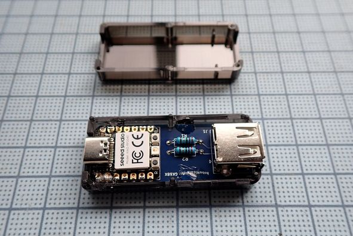
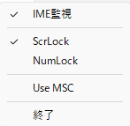
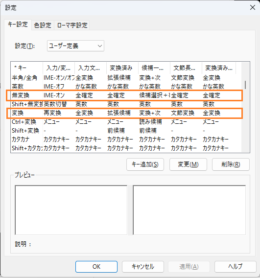
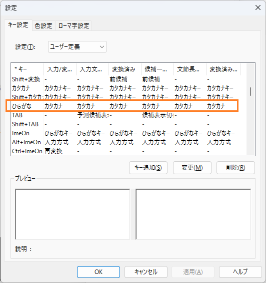

# hoboNicola library for FKB7628

本ライブラリはオリジナルのhoboNicola libraryを特定のキーボード向けアダプター用に一部改変したものです。Arduinoのスケッチ部分は \hoboNicolaLibrary\examples にあります。

	● 対象アダプター
	rp_hobo_nicola_FKB7628  : Seeed Stduio XIAO RP2040

	設定モードに入るには 右CTRL + MENU(App) + 100ms -> 'S'キー
	● FKB7628キーボードの設定モード; *3 + *6

## rp_hobo_nicola_FKB7628

	********************************************************
	*** CPU Seeed XIAO RP2040 (Raspberry Pi Pico/RP2040) ***
	*** CPU clock = 120MHz                               ***
	*** USB Stack = Adafruit TinyUSB                     ***
	********************************************************

	\作業ディレクトリ---+---\rp_hobo_nicola_FKB7628---rp_hobo_nicola_FKB7628.ino
	　                  |
	                    +---\libralies---+---\Adafruit_TinyUSB_Library
	                                     |
	                                     +---\hoboNicolaLibrary_FKB7628
	                                     |
	                                     +---\Pico_PIO_USB

## observe_imeとMS-IMEの設定

アダプターを使用する場合、observe_imeを利用すると所謂モードずれがないので便利です。デフォルトではScrLockでモード切替えをします。

以下はMS-IMEの設定例です(以前のバージョンを使用)。

カナ変換はF7キーで出来ますが、カタカナ/ひらがなキーにカタカナ変換を割り当てることも出来ます。

## 情報元
* https://github.com/okiraku-camera/hoboNicolaLibrary オリジナルのhoboNicola library。 
* https://github.com/okiraku-camera/observe_ime hoboNicolaで使用しているobserve_imeの情報です。
* https://www.pcbway.com/project/shareproject/hoboNicola_for_XIAO_RP2040_85b65544.html プリント基板の入手先です。

